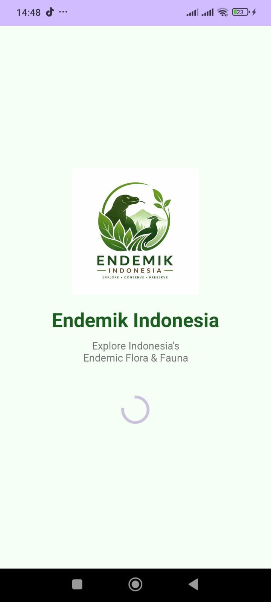
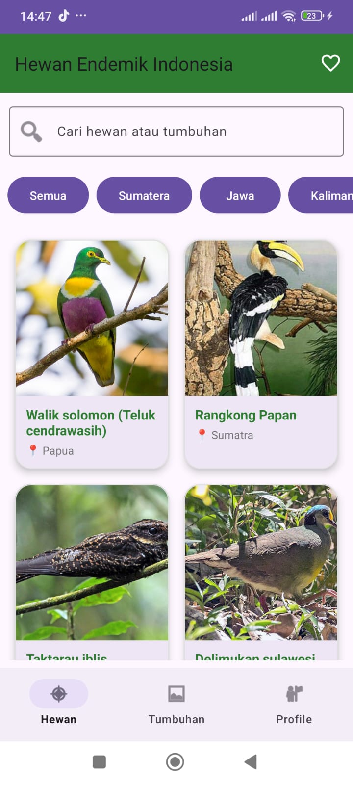
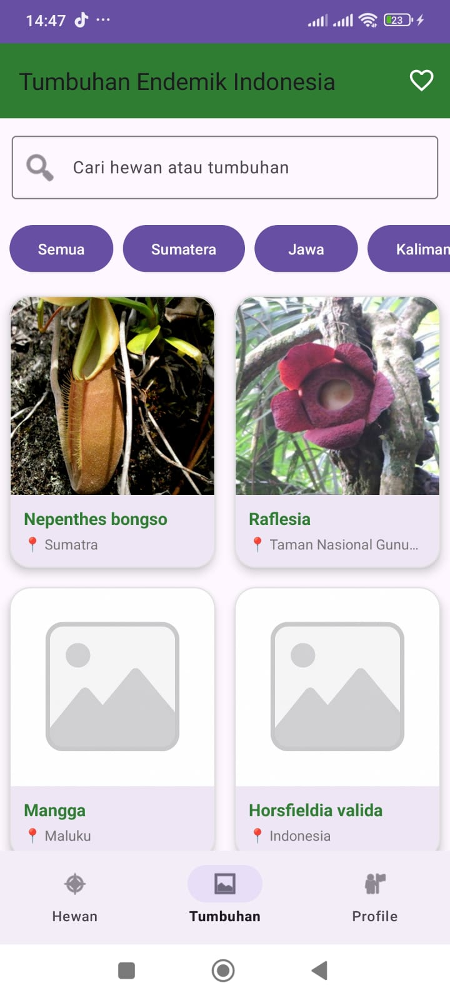
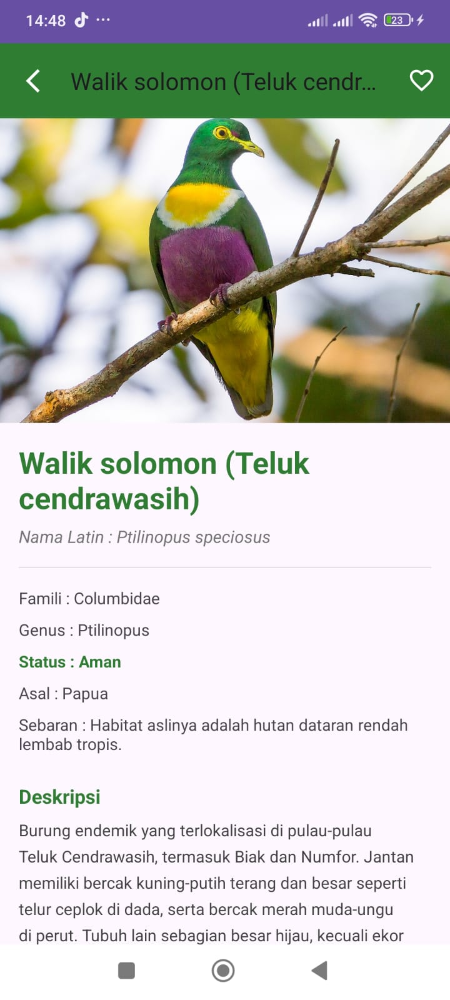
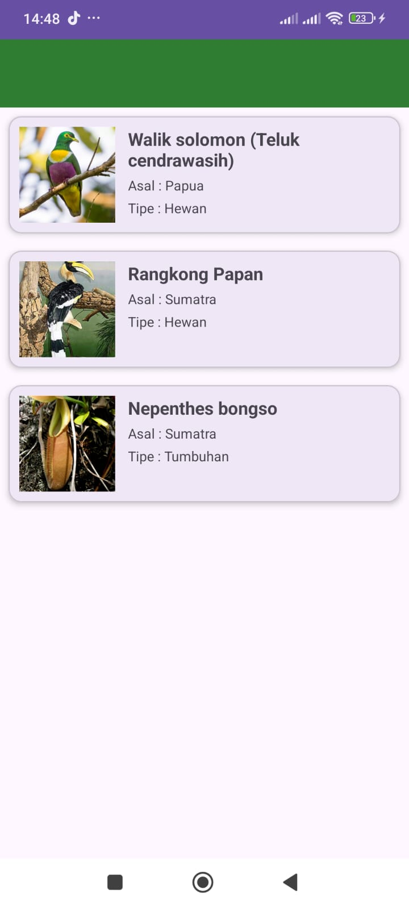
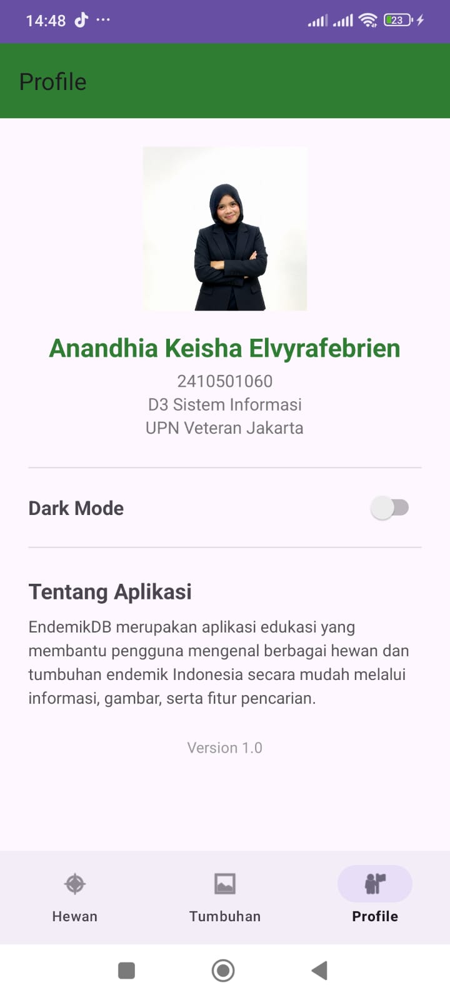

# EndemikDB

Aplikasi Android yang menampilkan informasi hewan dan tumbuhan endemik Indonesia.

## Fitur
- Daftar Hewan Endemik
- Daftar Tumbuhan Endemik
- Pencarian Data
- Filter Berdasarkan Wilayah
- Detail Informasi
- Favorite
- Dark Mode
- Profile

## Teknologi
- Kotlin
- Android Studio
- Retrofit
- Room Database
- Glide
- RecyclerView
- DataStore
- Material Design

## Screenshot
### Onboarding

### Hewan

### Tumbuhan

### Detail

### Favorite

### Profile

## Author
Anandhia Keisha Elvyrafebrien
NIM 2410501060
UPN Veteran Jakarta
